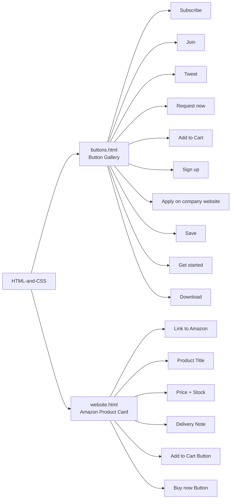
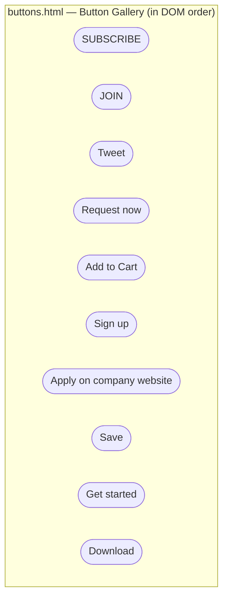
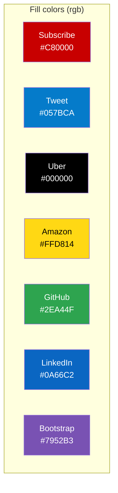
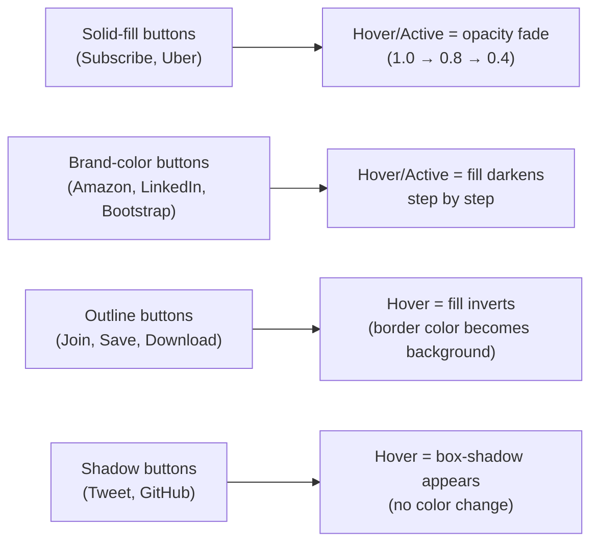
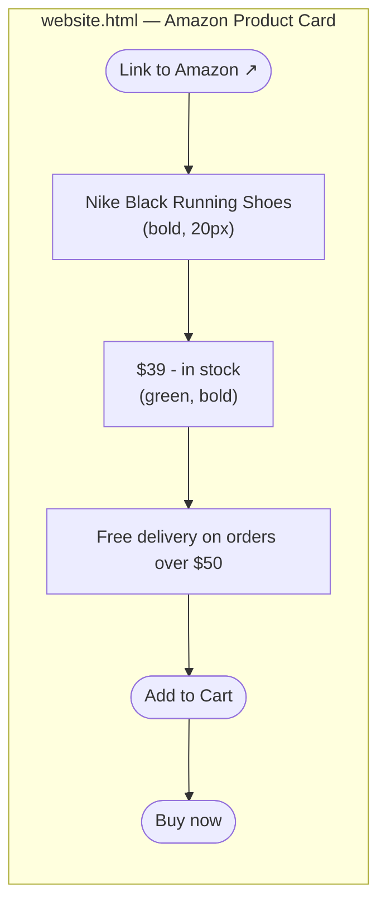
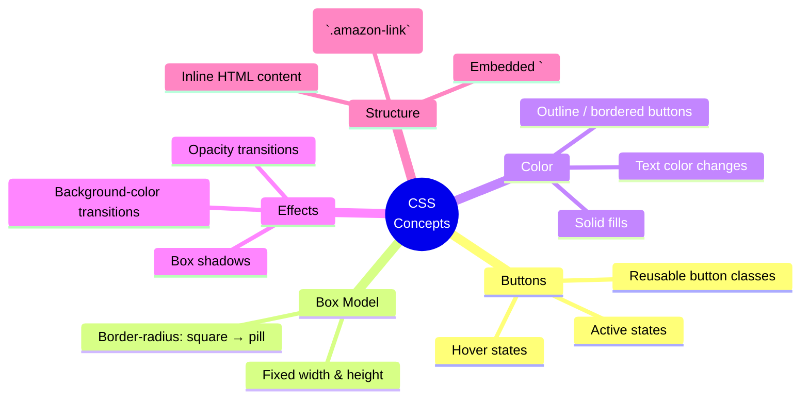
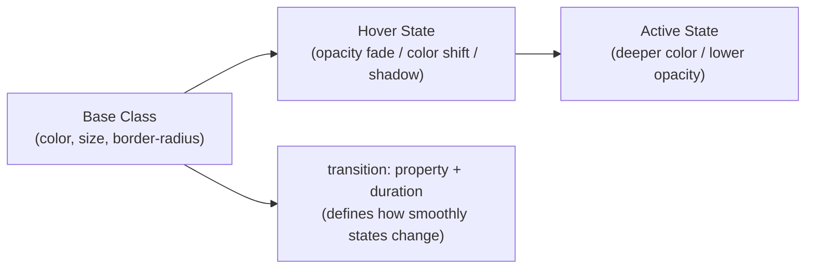
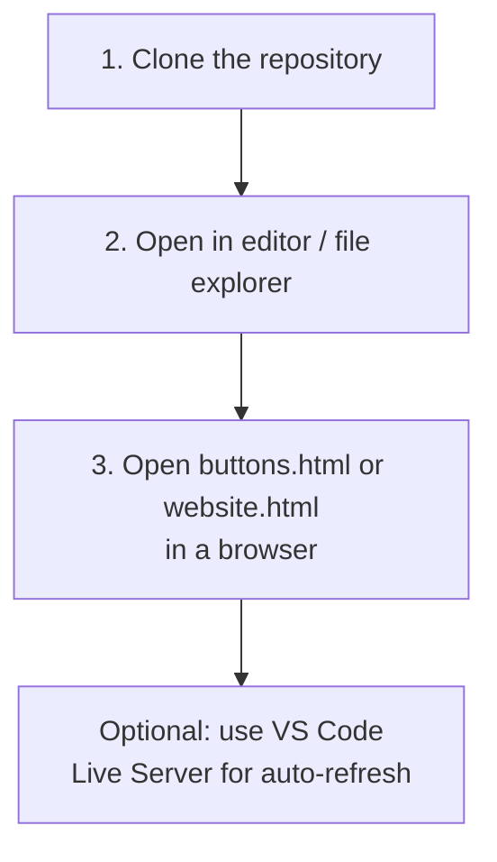
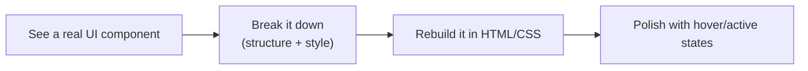

# 🎨 HTML & CSS Practice

<div align="center">

### A collection of beginner-friendly HTML and CSS exercises

Practice pages for recreating familiar web UI components with clean markup,
custom styling, hover states, and active states.

[View the repository](https://github.com/Betha-hemanth/HTML-and-CSS)

</div>

---

## 📌 What is inside?

| File | Focus | Highlights |
| --- | --- | --- |
| [`buttons.html`](buttons.html) | Button gallery | 10 recreated buttons — YouTube, LinkedIn, GitHub, Amazon, Bootstrap, Uber, Twitter, and more |
| [`website.html`](website.html) | Amazon product card | Product link, title, price, delivery note, cart button, and buy-now button |
| [`3DClick.html`](3DClick.html) | 3D button interaction | CSS 3D click/press effect practice |
| [`margin&padding.html`](margin%26padding.html) | CSS spacing | Practice with margin and padding |
| [`pagination.html`](pagination.html) | Pagination UI | Pagination layout and styling practice |
| [`strech.html`](strech.html) | Stretch layout | CSS sizing and layout practice |
| [`README.md`](README.md) | Documentation | Project overview and practice notes |



---

## 🔘 Button Gallery — `buttons.html`

Every button below is a real class from the file, with its base look and its `:hover` / `:active` behavior.

| Button | Class | Base Style | Hover | Active |
|---|---|---|---|---|
| **SUBSCRIBE** | `.subscribe-button` | Red `rgb(200,0,0)` fill, white text, square corners (2px), 105×36 | Opacity → 0.8 | Opacity → 0.4 |
| **JOIN** | `.join-button` | White fill, blue `rgb(5,103,178)` text + 1px border, 62×36 | Fills solid blue, text turns white | Opacity → 0.4 |
| **Tweet** | `.tweet-button` | Blue `rgb(5,123,202)` fill, white bold text, full pill (18px radius), 74×36 | Adds drop shadow | — |
| **Request now** (Uber) | `.uber-button` | Black fill, white text, square corners, 110×40 | Opacity → 0.8 | Opacity → 0.4 |
| **Add to Cart** (Amazon) | `.amazon-button` | Yellow `rgb(255,216,20)` fill, black text, pill (15px radius), 140×30 | Fill dims to `rgb(235,203,88)` | Fill darkens to `rgb(168,119,4)` |
| **Sign up** (GitHub) | `.github-button` | Green `rgb(46,164,79)` fill, white bold text, rounded (6px), 90×40 | Adds drop shadow | — |
| **Apply on company website** (LinkedIn) | `.linkedin-button` | Blue `rgb(10,102,194)` fill, white bold text, full pill, 200×36 | Fill darkens to `rgb(0,82,164)` | Fill darkens further to `rgb(0,62,124)` |
| **Save** | `.link-button` | White fill, blue outline + text, pill, bold small text, 64×36 | Opacity 0.6, border thickens to 2px, text darkens | Fill turns solid `rgb(0,82,124)` |
| **Get started** (Bootstrap) | `.bootstrap-button` | Purple `rgb(121,82,179)` fill, white text, square corners, 105×36 | Fill lightens to `rgb(139,87,215)` | Fill darkens to `rgb(81,42,139)` |
| **Download** | `.boot-button` | White fill, gray `rgb(108,117,125)` outline + text, bold, square corners, 105×36 | Fills solid gray, text turns white | Fill darkens to `rgb(73,80,87)` |



### 🎨 Color palette used across the gallery



### 🔗 Shared interaction patterns



---

## 🛍️ Product Card — `website.html`



| Element | Class | Base Style | Hover | Active |
|---|---|---|---|---|
| Link to Amazon | `.amazon-link` | Bold, 15px, plain text | Text turns orange `rgb(255,164,28)` | Text turns brown `rgb(168,119,4)` |
| Product title | *(inline style)* | Bold, 20px | — | — |
| Price | *(inline style)* | Green `rgb(0,118,0)`, bold | — | — |
| Add to Cart | `.amazon-button` | Yellow `rgb(255,216,20)` fill, pill (15px), 140×30 | Fill → orange `rgb(255,164,28)` | Fill → brown `rgb(168,119,4)` |
| Buy now | `.buynow-button` | Orange `rgb(255,164,28)` fill, pill (15px), 140×30 | Fill → yellow `rgb(255,216,20)` | Fill → brown `rgb(168,119,4)` |

> 💡 **Nice detail:** `Add to Cart` and `Buy now` swap colors on hover — Add to Cart turns orange (matching Buy now's resting color) and vice versa, giving the two buttons a connected, "toggle-like" feel.

---

## 🆕 Additional Practice Pages

### `3DClick.html`
Practice page focused on creating a 3D-style click/press interaction using HTML and CSS.

### `margin&padding.html`
Practice page for understanding CSS spacing, including margin and padding.

### `pagination.html`
Practice page for building and styling pagination controls.

### `strech.html`
Practice page focused on CSS sizing and stretch/layout behavior.

These pages extend the repository with additional hands-on HTML and CSS practice.

---

## 🧠 CSS Concepts Practiced



---

## 🔗 Anatomy of a Practiced Button



---

## 🚀 Run Locally



### 1. Clone the repository

```bash
git clone https://github.com/Betha-hemanth/HTML-and-CSS.git
```

### 2. Open either HTML file in a browser

```text
buttons.html
website.html
```

You can also use VS Code Live Server for automatic browser refreshes.

---

## 📚 Learning Source

These exercises are based on hands-on HTML and CSS practice and are intended
to make common interface patterns easier to understand and rebuild.


