# 🎨 HTML & CSS Practice

A beginner-friendly collection of HTML and CSS exercises for learning how to build and style common web UI components.

This repository focuses on **HTML structure, CSS styling, typography, spacing, buttons, hover/active states, pagination, sizing, 3D interactions, and simple product/course layouts**.

---

## 🗺️ Repository Overview

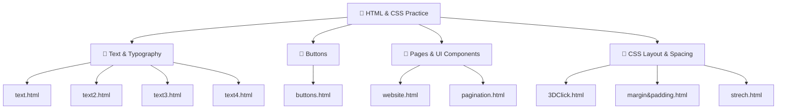

---

## 📁 Repository Files

| File | Focus |
|---|---|
| `3DClick.html` | 3D button interaction and click/press effect |
| `buttons.html` | Collection of styled UI buttons |
| `margin&padding.html` | CSS margin and padding practice |
| `pagination.html` | Pagination UI and styling |
| `strech.html` | CSS sizing and stretch/layout practice |
| `text.html` | Video-style text and promotional content |
| `text2.html` | Typography and Tahoma font styling |
| `text3.html` | Promotional/deals text layout |
| `text4.html` | HTML & CSS course card |
| `website.html` | Amazon-style product card |
| `README.md` | Repository documentation |

The repository currently contains these 11 files on the `main` branch. citeturn1view0

---

# 📝 1. Text & Typography Practice

The four text files provide a progression from basic text styling to more complete UI sections.

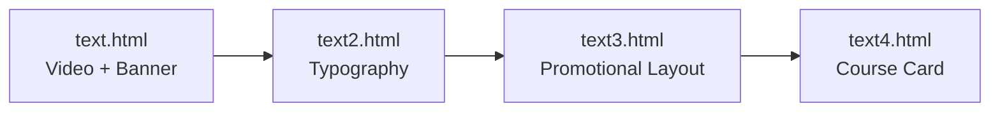

### `text.html`

Practices a video-style text section with a title, statistics, author, description, and promotional shopping content.

**Concepts:**
- Font family
- Font size
- Font weight
- Width
- Margins
- Line height
- Colors
- Padding
- Hover styling

### `text2.html`

Focuses on typography using a Tahoma font style.

**Concepts:**
- `font-family`
- `font-size`
- `font-weight`
- CSS classes

### `text3.html`

Creates a promotional/deals section with centered text and interactive text.

**Concepts:**
- Text alignment
- Bold text
- Italic text
- Font sizing
- Colors
- Margins
- Hover effects
- Underline effects

### `text4.html`

Creates a simple HTML & CSS course card containing a course title, beginner-to-pro text, description, and a Get Started button.

**Concepts:**
- Typography
- Spacing
- Width
- Colors
- Border radius
- Button styling

---

# 🔘 2. Button Gallery — `buttons.html`

The button page recreates 10 familiar UI button styles.

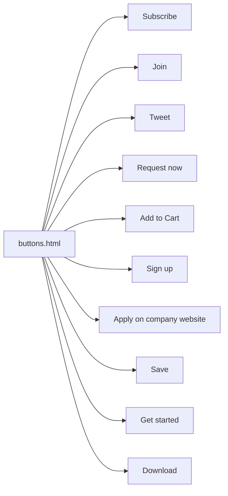

### Button Styles

| Button | Main Style |
|---|---|
| Subscribe | Red filled button |
| Join | Outline/filled blue button |
| Tweet | Blue pill button + shadow |
| Request now | Black filled button |
| Add to Cart | Yellow Amazon-style button |
| Sign up | Green GitHub-style button |
| Apply on company website | Blue LinkedIn-style button |
| Save | Outline button |
| Get started | Purple Bootstrap-style button |
| Download | Gray outline button |

The repository README documents the actual classes, dimensions, colors, hover behavior, and active behavior for these buttons. citeturn1view0

### 🎯 Interaction Patterns

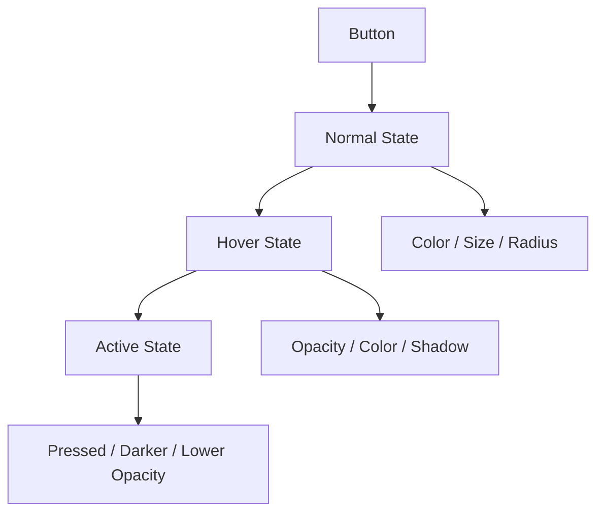

---

# 🛍️ 3. Product Card — `website.html`

This exercise creates an Amazon-style product card.

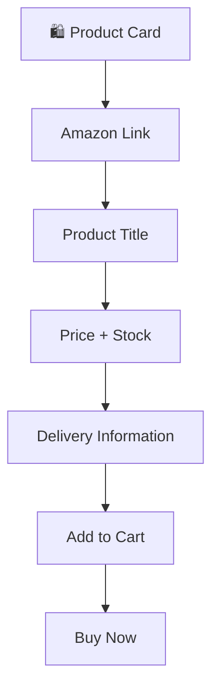

### Concepts Practiced

- Links
- Font styling
- Product information layout
- Colors
- Button styling
- Border radius
- Hover effects
- Active effects
- Spacing

The current README describes the product as Nike Black Running Shoes and documents the Add to Cart / Buy now interactions. citeturn1view0

---

# 🧊 4. 3D Button Interaction — `3DClick.html`

This page focuses on creating a **3D-style click/press interaction**.

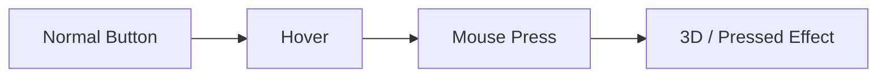

### Concepts

- Button styling
- CSS positioning
- Visual depth
- Click/press interaction
- CSS transitions/effects

---

# 📦 5. Margin & Padding — `margin&padding.html`

This exercise focuses on the CSS box model and the difference between **margin** and **padding**.

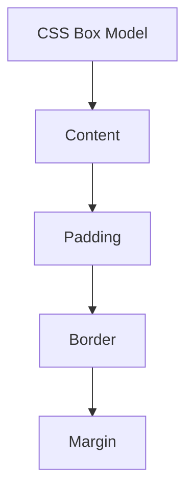

### Concepts

- `margin`
- `padding`
- Box model
- Element spacing
- Layout positioning

---

# 📄 6. Pagination — `pagination.html`

This page practices creating a pagination interface for navigating between pages.

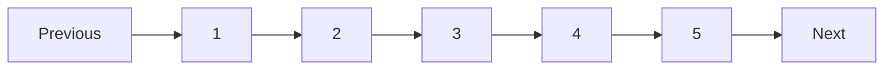

### Concepts

- Links
- Inline/block layout
- Spacing
- Borders
- Hover states
- Active page styling
- Navigation UI

---

# 📐 7. Stretch & Sizing — `strech.html`

This exercise focuses on CSS sizing and stretch behavior.

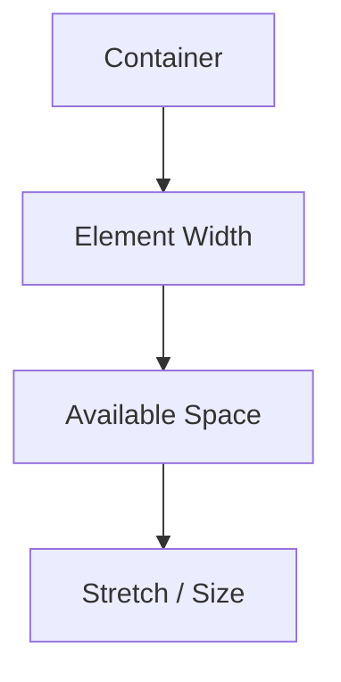

### Concepts

- Width
- Height
- Element sizing
- Available space
- CSS layout behavior

---

# 🎨 CSS Concepts Practiced

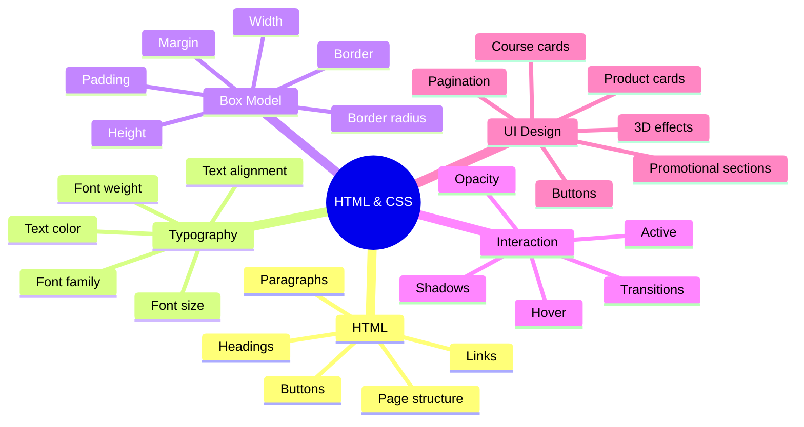

---

# 🔄 Learning Progression

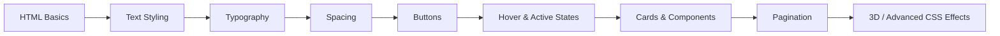

---

# 🧠 Skills Developed

By completing this repository, you practice:

- Building HTML pages
- Writing CSS inside HTML files
- Creating reusable CSS classes
- Styling text and fonts
- Understanding the CSS box model
- Working with margin and padding
- Creating buttons
- Styling links
- Using hover and active states
- Creating shadows and visual effects
- Building product cards
- Building course cards
- Creating pagination
- Understanding basic layout and sizing
- Recreating familiar UI components

---

# 🛠️ Technologies Used

- **HTML5**
- **CSS3**
- **Visual Studio Code**
- **Web Browser**
- **Git**
- **GitHub**

No JavaScript framework or external UI framework is required for these exercises.

---

# 🚀 How to Run

## 1. Clone the Repository

```bash
git clone https://github.com/Betha-hemanth/HTML-and-CSS.git
```

## 2. Open the Project

```bash
cd HTML-and-CSS
```

## 3. Open Any HTML File

For example:

```text
buttons.html
website.html
text.html
text2.html
text3.html
text4.html
3DClick.html
margin&padding.html
pagination.html
strech.html
```

## 4. Run in Browser

Open the selected HTML file directly in a browser.

For a better development workflow, you can use **VS Code Live Server**.

---

# 📂 Project Structure

```text
HTML-and-CSS/
│
├── 3DClick.html
├── buttons.html
├── margin&padding.html
├── pagination.html
├── strech.html
├── text.html
├── text2.html
├── text3.html
├── text4.html
├── website.html
│
└── README.md
```

---

# 🎯 Learning Goals

The main goal of this repository is to strengthen the fundamentals required before moving into more advanced frontend development.

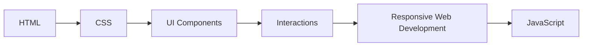

---

# 🔮 Future Improvements

Possible future additions to this repository:

- Responsive layouts
- Flexbox exercises
- CSS Grid exercises
- Media queries
- More button animations
- Navigation bars
- Forms
- Login pages
- Landing pages
- Responsive cards
- JavaScript interactions

---

# 👨‍💻 Author

**Betha Hemanth**

HTML & CSS Practice Repository

---

⭐ If you find this repository useful for learning HTML and CSS, consider giving it a star!

---

## 📌 Repository

GitHub repository:  
https://github.com/Betha-hemanth/HTML-and-CSS

