# 🎨 HTML & CSS Practice

A beginner-friendly collection of HTML and CSS practice pages focused on building familiar UI components and learning practical CSS styling.

## 🗺️ Visual Repository Map

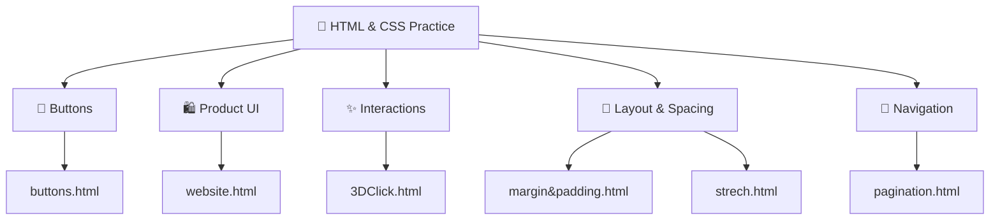

## 📁 Repository Files

| File | Focus |
|---|---|
| `3DClick.html` | 3D button interaction |
| `buttons.html` | 10 styled UI buttons |
| `margin&padding.html` | CSS spacing and box model |
| `pagination.html` | Pagination UI |
| `strech.html` | CSS sizing/stretch behavior |
| `website.html` | Amazon-style product card |
| `README.md` | Documentation |

These are the files currently listed in the repository. citeturn0view0

---

# 🔘 `buttons.html` — Button Gallery

The repository contains 10 recreated button styles inspired by familiar UI designs: Subscribe, Join, Tweet, Request now, Add to Cart, Sign up, Apply, Save, Get started, and Download. citeturn0view0

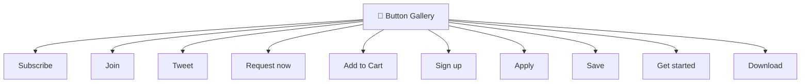

### 🖱️ Interaction Model

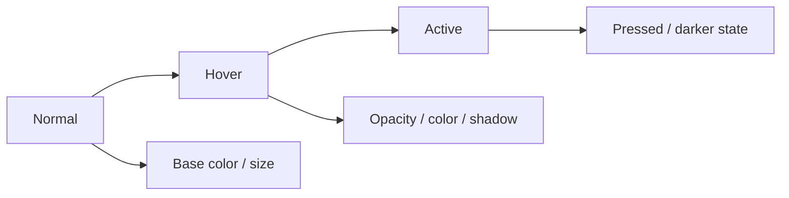

The existing repository documents hover and active behavior including opacity changes, color changes, borders, and shadows. citeturn0view0

---

# 🛍️ `website.html` — Product Card

Creates an Amazon-style product card with a product link, title, price, delivery information, Add to Cart, and Buy now buttons. citeturn0view0

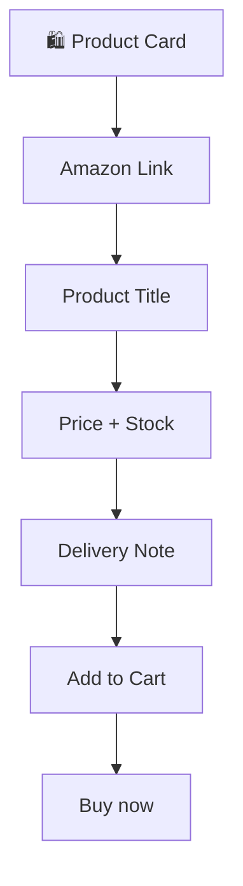

The two action buttons use different colors and swap their yellow/orange hover behavior. citeturn0view0

---

# ✨ `3DClick.html` — 3D Click Effect

Practice page for creating a 3D-style click/press interaction. citeturn0view0

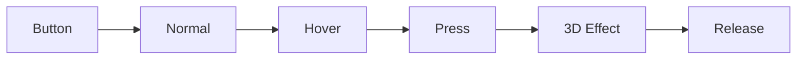

---

# 📦 `margin&padding.html` — CSS Box Model

Practice page for understanding CSS margin and padding. citeturn0view0

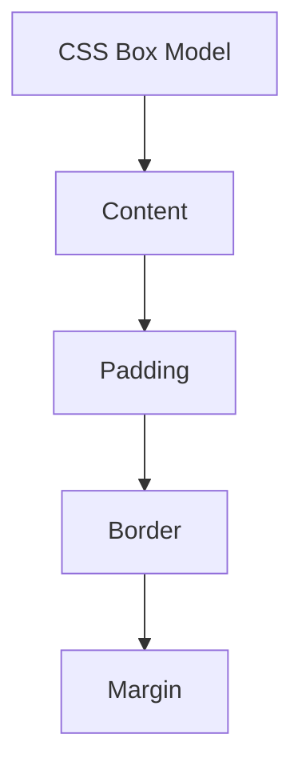

```text
┌──────────────────────────┐
│          MARGIN          │
│  ┌────────────────────┐  │
│  │       BORDER       │  │
│  │  ┌──────────────┐  │  │
│  │  │   PADDING    │  │  │
│  │  │  ┌────────┐  │  │  │
│  │  │  │CONTENT │  │  │  │
│  │  │  └────────┘  │  │  │
│  │  └──────────────┘  │  │
│  └────────────────────┘  │
└──────────────────────────┘
```

---

# 📄 `pagination.html` — Pagination

Practice page for building and styling pagination controls. citeturn0view0

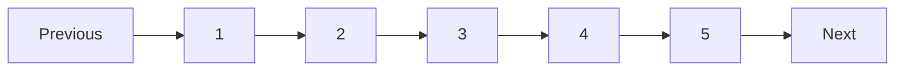

---

# 📐 `strech.html` — Sizing & Stretch

Practice page focused on CSS sizing and stretch/layout behavior. citeturn0view0

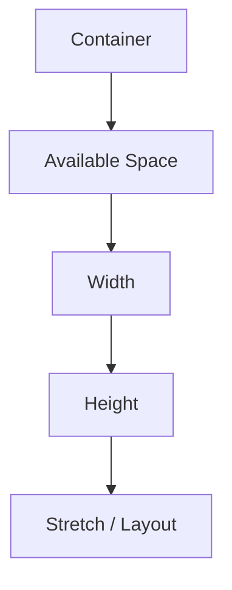

---

# 🎨 CSS Concepts Practiced

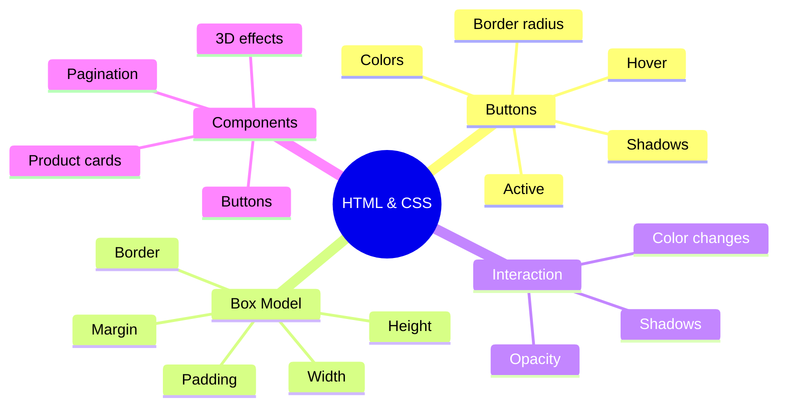

The repository documentation specifically covers reusable button classes, hover/active states, fixed dimensions, border radius, colors, opacity, background-color changes, and box shadows. citeturn0view0

---

# 🔄 Learning Progression

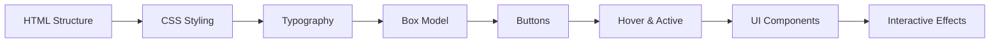

---

# 🧠 Skills Practiced

- HTML structure
- CSS classes
- Typography
- Colors
- Width and height
- Margin and padding
- Borders
- Border radius
- Buttons
- Links
- Hover effects
- Active effects
- Opacity
- Box shadows
- Pagination
- Product-card design
- Basic UI interactions

---

# 🛠️ Technologies

```text
HTML5
CSS3
VS Code
Web Browser
Git
GitHub
```

---

# 🚀 Run Locally

### 1. Clone

```bash
git clone https://github.com/Betha-hemanth/HTML-and-CSS.git
```

### 2. Open

```bash
cd HTML-and-CSS
```

### 3. Choose a page

```text
3DClick.html
buttons.html
margin&padding.html
pagination.html
strech.html
website.html
```

### 4. Run

Open the HTML file in a browser, or use VS Code Live Server.

---

# 📂 Project Structure

```text
HTML-and-CSS/
│
├── 3DClick.html
├── buttons.html
├── margin&padding.html
├── pagination.html
├── strech.html
├── website.html
│
└── README.md
```

---

# 🎯 Learning Goal

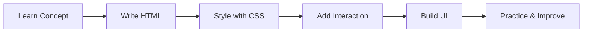

The goal is to learn HTML and CSS through hands-on recreation of UI components rather than theory alone. citeturn0view0

---

# 🔮 Future Improvements

- Flexbox
- CSS Grid
- Responsive design
- Media queries
- Navigation bars
- Forms
- Login pages
- Landing pages
- Responsive cards
- CSS animations
- More interactive components
- JavaScript interactions

---

# 👨‍💻 Author

**Betha Hemanth**

HTML & CSS Practice Repository

⭐ If this repository helps you learn HTML and CSS, consider giving it a star!
