# 🎨 HTML & CSS Practice

A beginner-friendly collection of **HTML and CSS practice projects** focused on learning web development through hands-on exercises.

This repository contains practice pages covering **text styling, buttons, layouts, spacing, pagination, product cards, hover effects, active states, and CSS interactions**.

---

## 🗺️ Repository Overview

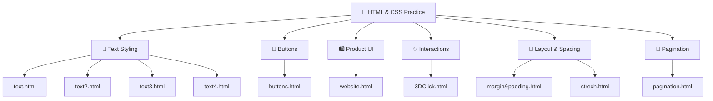

---

# 📁 Repository Structure

The repository currently contains HTML pages and their corresponding CSS files.

```text
HTML-and-CSS/
│
├── 3DClick.html
├── 3Dclick.css
│
├── buttons.html
├── buttons.css
│
├── margin&padding.html
├── margin&padding.css
│
├── pagination.html
├── pagination.css
│
├── strech.html
├── strech.css
│
├── text.html
├── text.css
│
├── text2.html
├── text2.css
│
├── text3.html
├── text3.css
│
├── text4.html
├── text4.css
│
├── website.html
├── website.css
│
└── README.md
```

---

# 📝 Text Styling Practice

The repository contains four text-focused practice pages:

* `text.html`
* `text2.html`
* `text3.html`
* `text4.html`

These exercises are used to practice different aspects of **HTML text structure and CSS text styling**.

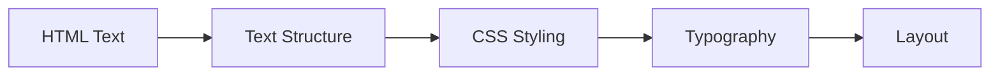

### Concepts Practiced

* Text elements
* Font styling
* Font size
* Text color
* Text alignment
* Spacing
* Paragraph styling
* CSS classes
* External CSS files

---

# 🔘 `buttons.html` — Button Gallery

`buttons.html` contains **10 recreated button styles** inspired by familiar interfaces such as YouTube, LinkedIn, GitHub, Amazon, Bootstrap, Uber and Twitter.

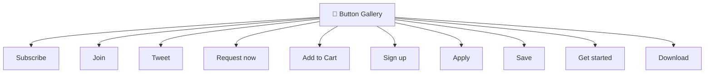

## Button Styles

| Button      | Class               | Main Concept             |
| ----------- | ------------------- | ------------------------ |
| Subscribe   | `.subscribe-button` | Color & opacity          |
| Join        | `.join-button`      | Border & hover           |
| Tweet       | `.tweet-button`     | Border radius & shadow   |
| Request now | `.uber-button`      | Dark button styling      |
| Add to Cart | `.amazon-button`    | Background colors        |
| Sign up     | `.github-button`    | Green button & shadow    |
| Apply       | `.linkedin-button`  | Brand-style button       |
| Save        | `.link-button`      | Outline button           |
| Get started | `.bootstrap-button` | Purple button            |
| Download    | `.boot-button`      | Outline-to-filled effect |

The button styles demonstrate different **hover and active states**, including opacity changes, color changes, border changes and shadows.

---

# 🖱️ Button Interaction Model

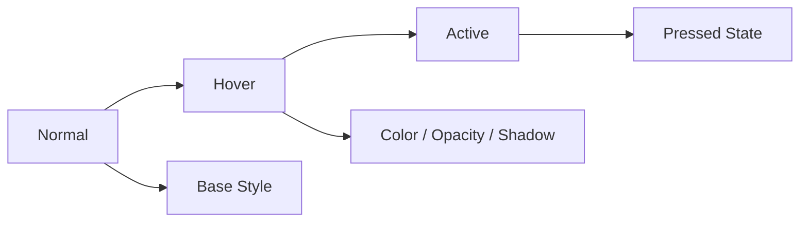

### Interaction concepts

* `:hover`
* `:active`
* `opacity`
* `background-color`
* `color`
* `border`
* `border-radius`
* `box-shadow`
* `transition`

---

# 🛍️ `website.html` — Product Card

`website.html` contains an **Amazon-style product card** with a product link, title, price, delivery information and purchase buttons.

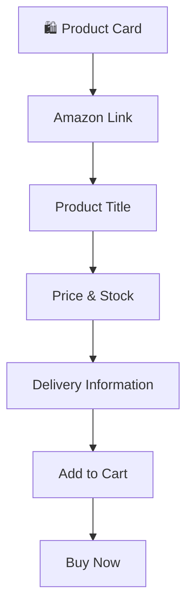

### Product Card Components

* Amazon product link
* Product title
* Product price
* Stock information
* Delivery information
* Add to Cart button
* Buy Now button

The project also demonstrates interactive button color changes between **Add to Cart** and **Buy Now**.

---

# ✨ `3DClick.html` — 3D Click Effect

Practice page for creating a **3D-style button click interaction** using HTML and CSS.

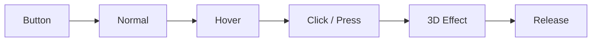

### Concepts

* Button styling
* Hover states
* Active states
* CSS positioning
* Shadows
* Click/press effects
* Transitions

---

# 📦 `margin&padding.html` — CSS Box Model

This page focuses on understanding the **CSS Box Model**, especially margin and padding.

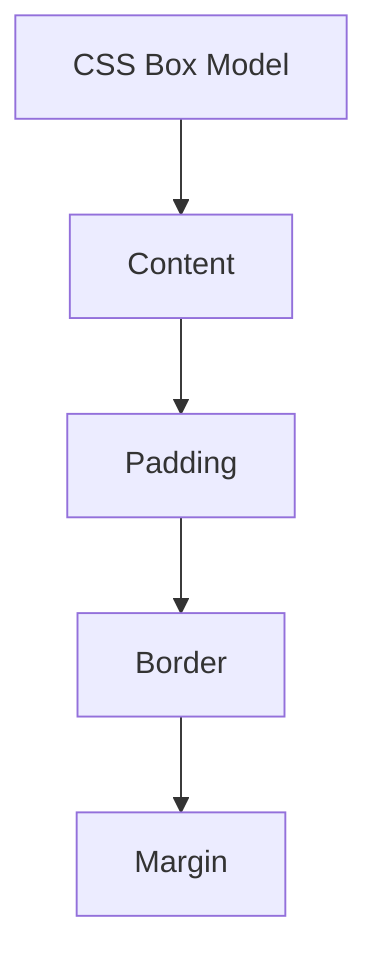

```text
┌──────────────────────────┐
│          MARGIN          │
│  ┌────────────────────┐  │
│  │       BORDER       │  │
│  │  ┌──────────────┐  │  │
│  │  │   PADDING    │  │  │
│  │  │  ┌────────┐  │  │  │
│  │  │  │ CONTENT│  │  │  │
│  │  │  └────────┘  │  │  │
│  │  └──────────────┘  │  │
│  └────────────────────┘  │
└──────────────────────────┘
```

### Concepts

* Content
* Padding
* Border
* Margin
* Width
* Height
* Spacing

---

# 📄 `pagination.html` — Pagination

Practice page for creating and styling pagination controls.

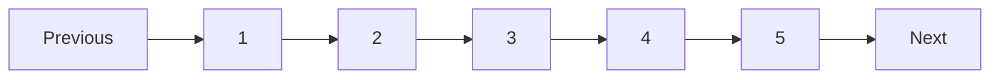

### Concepts

* Navigation
* Links
* Spacing
* Borders
* Hover effects
* Active page styling
* Button-like navigation

---

# 📐 `strech.html` — Sizing & Stretch

Practice page focused on **CSS sizing and layout behavior**.

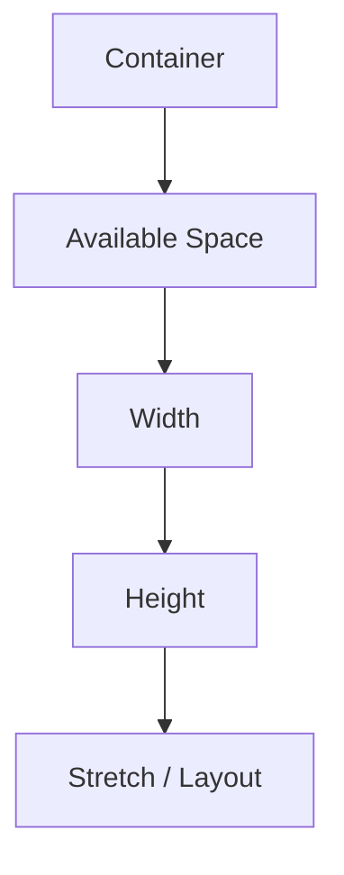

### Concepts

* Width
* Height
* Available space
* Element sizing
* Layout behavior
* CSS dimensions

---

# 🎨 CSS Concepts Practiced

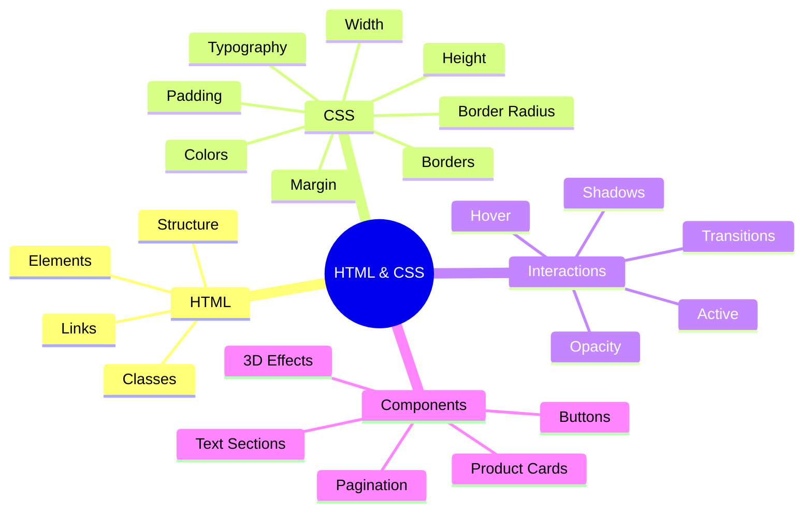

---

# 🧠 Skills Practiced

### HTML

* HTML document structure
* Headings
* Paragraphs
* Links
* Buttons
* Classes
* Basic UI structure

### CSS

* Selectors
* Classes
* Colors
* Typography
* Font size
* Width & height
* Margin
* Padding
* Borders
* Border radius
* Background colors
* Opacity
* Box shadows
* Hover states
* Active states
* Transitions

### UI Development

* Button components
* Product cards
* Pagination
* Text layouts
* Interactive elements
* 3D button effects

---

# 🛠️ Technologies

```text
HTML5
CSS3
VS Code
Web Browser
Git
GitHub
```

---

# 🔄 Learning Progression

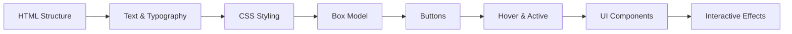

The repository follows a practical learning approach: understand a concept, recreate it with HTML/CSS, and experiment with styling and interactions.

---

# 🚀 Run Locally

## 1. Clone the Repository

```bash
git clone https://github.com/Betha-hemanth/HTML-and-CSS.git
```

## 2. Open the Project

```bash
cd HTML-and-CSS
```

## 3. Open an HTML File

Choose any practice page:

```text
3DClick.html
buttons.html
margin&padding.html
pagination.html
strech.html
text.html
text2.html
text3.html
text4.html
website.html
```

## 4. Run

Open the HTML file directly in a web browser.

You can also use **VS Code Live Server** for automatic browser refresh.

---

# 📂 Project Categories

```text
HTML-and-CSS/
│
├── 🔘 Buttons
│   ├── buttons.html
│   └── buttons.css
│
├── 📝 Text Styling
│   ├── text.html
│   ├── text.css
│   ├── text2.html
│   ├── text2.css
│   ├── text3.html
│   ├── text3.css
│   ├── text4.html
│   └── text4.css
│
├── 🛍️ Product UI
│   ├── website.html
│   └── website.css
│
├── 📦 Box Model
│   ├── margin&padding.html
│   └── margin&padding.css
│
├── 📄 Pagination
│   ├── pagination.html
│   └── pagination.css
│
├── 📐 Layout
│   ├── strech.html
│   └── strech.css
│
├── ✨ 3D Interaction
│   ├── 3DClick.html
│   └── 3Dclick.css
│
└── README.md
```

---

# 🎯 Learning Goal

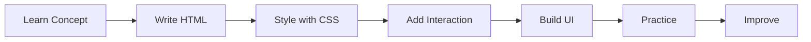

The main goal of this repository is to **learn HTML and CSS through practical implementation** rather than theory alone.

By recreating familiar UI patterns, the project builds a foundation for creating more advanced web interfaces.

---

# 🔮 Future Improvements

The repository can be expanded with:

* Flexbox
* CSS Grid
* Responsive design
* Media queries
* Navigation bars
* Forms
* Login pages
* Registration pages
* Landing pages
* Responsive cards
* CSS animations
* CSS transitions
* JavaScript interactions
* Responsive navigation
* Mobile-first layouts
* More reusable UI components

---

# 👨‍💻 Author

**Betha Hemanth**

B.Tech — Computer Science Engineering

HTML & CSS Practice Repository

---

## ⭐ Support

If this repository helps you learn **HTML and CSS**, consider giving it a ⭐ on GitHub!


