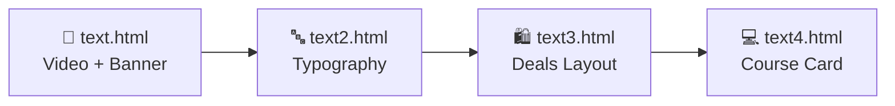
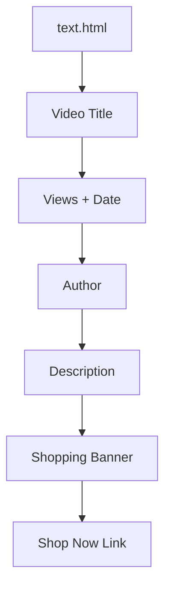
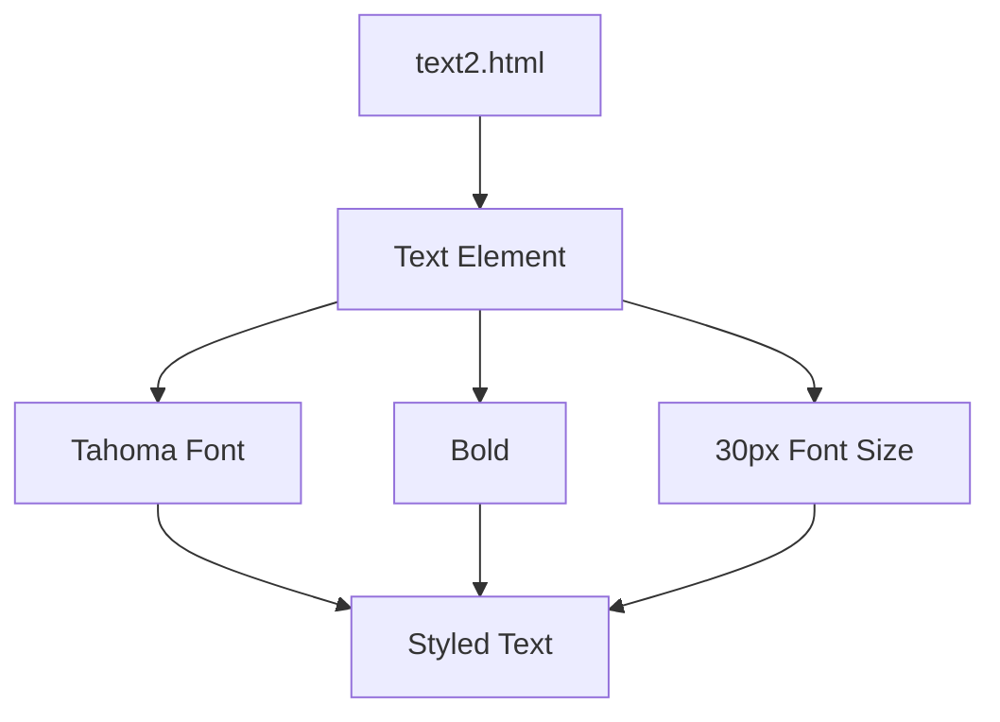
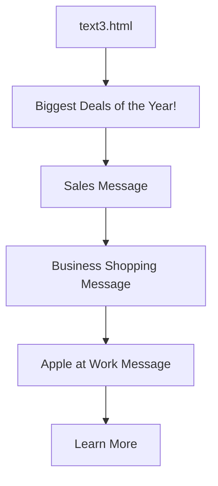
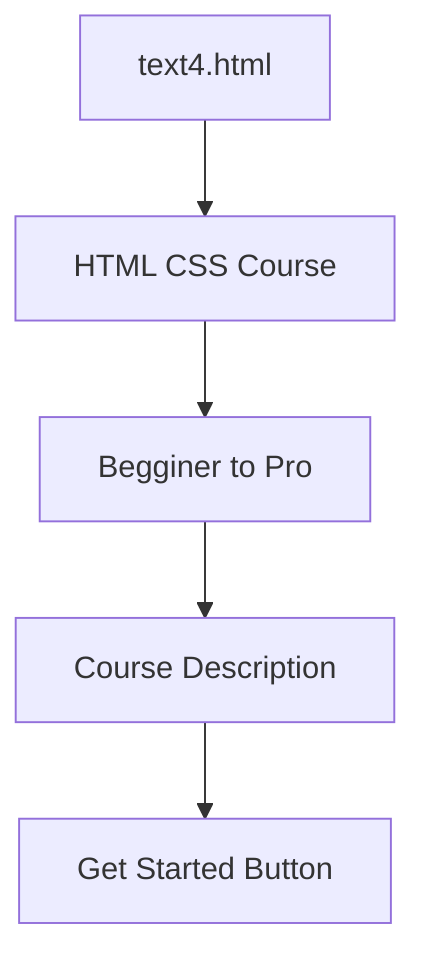
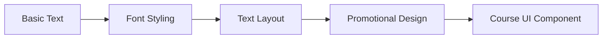

# 📝 HTML Text Practice

A dedicated collection of four beginner-friendly HTML and CSS exercises focused on **text styling, typography, spacing, promotional layouts, hover effects, and simple UI design**.

---

## 📚 Files

| File | Main Focus |
|---|---|
| `text.html` | Video-style text and promotional banner |
| `text2.html` | Tahoma font and typography |
| `text3.html` | Promotional/deals text layout |
| `text4.html` | HTML & CSS course card |

---

## 🗺️ Visual Overview



---

# 1️⃣ `text.html`

### 🎯 Purpose

This page practices creating a video-style text section and a promotional shopping banner.

### 🧩 Structure



### 🎨 Concepts Practiced

- Font family
- Font size
- Font weight
- Width
- Margins
- Line height
- Text color
- Background color
- Padding
- Hover effect
- Text decoration

### 💡 Main Idea

The page demonstrates how different text elements can be combined to create a realistic web-page section.

---

# 2️⃣ `text2.html`

### 🎯 Purpose

This exercise focuses on **font styling and typography**.

### 🧩 Visual Structure



### 🎨 Concepts Practiced

- `font-family`
- `font-weight`
- `font-size`
- CSS classes
- Typography

### 💡 Main Idea

A simple exercise showing how CSS can change the appearance of text using different font properties.

---

# 3️⃣ `text3.html`

### 🎯 Purpose

This page practices creating a **promotional/deals section** with different text styles.

### 🧩 Visual Structure



### 🎨 Concepts Practiced

- Text alignment
- Font size
- Bold text
- Italic text
- Text color
- Margins
- Line height
- Hover effects
- Underline effects

### 💡 Main Idea

The exercise demonstrates how typography and spacing can be used to create an attractive promotional section.

---

# 4️⃣ `text4.html`

### 🎯 Purpose

This page creates a simple **HTML & CSS course introduction/card**.

### 🧩 Visual Structure



### 🎨 Concepts Practiced

- Font family
- Font size
- Font weight
- Text color
- Width
- Margins
- Padding
- Background color
- Border radius
- Button styling
- Cursor styling

### 💡 Main Idea

This exercise combines text styling and button styling to create a small course UI component.

---

# 📊 Comparison

| File | Typography | Layout | Interaction | UI Component |
|---|---|---|---|---|
| `text.html` | ⭐⭐⭐ | ⭐⭐⭐ | ⭐⭐ | ⭐⭐⭐ |
| `text2.html` | ⭐⭐⭐ | ⭐ | ⭐ | ⭐ |
| `text3.html` | ⭐⭐⭐ | ⭐⭐⭐ | ⭐⭐ | ⭐⭐⭐ |
| `text4.html` | ⭐⭐⭐ | ⭐⭐⭐ | ⭐⭐ | ⭐⭐⭐⭐ |

---

# 🔄 Learning Progression



---

# 🧠 Skills Learned

By completing these exercises, you practice:

- Writing HTML text elements
- Creating CSS classes
- Styling fonts
- Controlling text size
- Controlling spacing
- Using colors
- Aligning text
- Creating hover states
- Styling links
- Styling buttons
- Building simple UI sections

---

# 🚀 How to Run

### Option 1 — Browser

Open any HTML file directly in your browser:

```text
text.html
text2.html
text3.html
text4.html
```

### Option 2 — VS Code

1. Open the project folder in VS Code.
2. Open one of the HTML files.
3. Use **Live Server** if installed.
4. View the result in your browser.

---

# 📁 Project Structure

```text
HTML-and-CSS/
│
├── text.html
├── text2.html
├── text3.html
├── text4.html
│
└── README.md
```

---

## ⭐ Learning Goal

The goal of these exercises is to build a strong foundation in **HTML text elements and CSS typography**, then apply those skills to realistic web-page sections and UI components.

---

## 👨‍💻 Author

**Betha Hemanth**

HTML & CSS Practice
